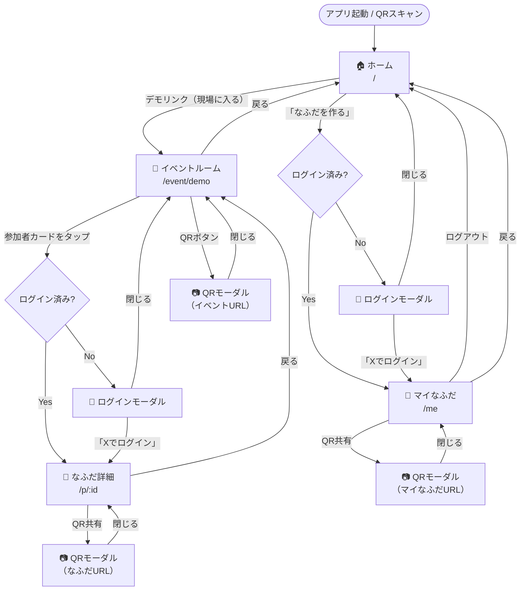

# プロトタイプ スコープ定義

> Phase 0 — UX検証用モックアップ
> DB不使用・フロントエンドのみ
> アプリ名称: **なふだ**

---

## 目的

* **「出会いに、文脈を。」** のコア体験を動く形で確認する
* 推し活ユーザーが「現場でつながる」→「後から見返す」体験を自然に感じられるかを検証する
* 関係者へのデモ・壁打ちに使用できる状態を目指す
* 技術的な実現性よりも **UXの自然さ・推し活文脈での違和感のなさ** を優先して検証する

### 検証したい仮説

1. ライブ・聖地で「同じ現場にいた人」と一括でつながる体験は、従来の名刺・SNS ID交換より負荷が低く感じられる
2. プロフィールに「推し・ジャンル・参加現場」が載っていることで、会話・記憶のきっかけになる
3. 匿名・ハンドルネーム運用が前提でも、つながりの価値が成立する

---

## 作るもの

### 画面一覧

| 画面 | パス | 概要 |
|------|------|------|
| ホーム | `/` | アプリ説明・「なふだを作る」CTA・デモ用リンク（下部に小さく表示） |
| イベントルーム | `/event/:id` | 参加者カード（推し・ジャンルタグ付き）がアニメーションで出現。ヘッダーにQR共有ボタン。idはプロト固定の `demo`（聖地・ライブ想定） |
| プロフィール詳細 | `/p/:id` | 他者のなふだ表示（閲覧にはログインが必要）。推し・ジャンル・参加現場履歴を表示。QR共有モーダルあり |
| マイなふだ | `/me` | 自分のなふだ表示・QR共有。ログアウトボタンあり |

> **IDフォーマット:**
> * イベントID: 大文字英数字6文字（例: `K3P9XD`）。プロトでは `demo` 固定
> * プロフィールID: nanoid 8文字ランダム（例: `a3k9dxwq`）。同一人物の複数プロフィール（推し活用／本業用）も別IDで独立

### 機能一覧

| 機能 | 実装内容 |
|------|------|
| 「なふだを作る」ボタン | 未ログイン時はログインモーダルを表示 → ログイン後 `/me` へ遷移 |
| イベント参加 | `/event/demo` にアクセスすると参加者カードが表示される（QRはネイティブカメラで読み取る） |
| 参加者カード表示 | モックデータの参加者カードが300msごとにアニメーションで出現。推し・ジャンルタグ／同担設定アイコンを表示 |
| 推し・ジャンルタグ | プロフィール／参加者カードにバッジとして表示（モックデータ） |
| 参加現場履歴 | プロフィール詳細に「参加した現場」のリスト（モックデータ） |
| 参加者詳細閲覧 | 未ログイン時はログインモーダル。ログイン後に詳細・SNSリンク・QR共有を表示 |
| モックログイン | 「Xでログイン」タップ → ログイン状態にセット（実際の認証なし） |
| QR共有モーダル | イベントルーム・プロフィール詳細・マイなふだの各画面でQRコードを表示 |
| マイなふだ表示 | ログイン後、自分のなふだ（固定ID `a3k9dxwq`）を確認できる |
| PWAインストール | ブラウザのインストールバナーを表示、1タップでホーム画面に追加（`pnpm preview` 以降で動作） |
| デモ用リンク | ホーム画面下部に小さく「現場に入る（デモ）」リンクを表示（デモ専用） |

---

## 作らないもの（モックアウトする範囲）

| 項目 | 対応方針 |
|------|------|
| ソーシャルログイン（実装） | タップでログイン状態を切り替えるモックで代替 |
| QRコードスキャン機能 | モバイルのネイティブカメラアプリで代替 |
| データベース・API | すべてモックデータ（`src/mock/data.ts`）で代替 |
| ユーザー登録フロー | スキップ（ログインモックで代替） |
| プロフィール編集 | スキップ（「編集（近日公開）」ボタンを disabled で表示） |
| イベント作成・管理 | スキップ（イベントIDは固定の `/event/demo` のみ） |
| 複数プロフィール機能 | スキップ |
| つながり追加（実装） | ボタンのみ表示（機能なし） |
| 同担設定の実装 | 設定画面は持たず、モックデータでアイコン表示のみ確認 |
| 公開範囲設定の実装 | 同上。UI確認のみ |

---

## モックデータ構成

```ts
// src/mock/data.ts

export const mockEvent = {
  id: 'demo', // 本番形式イメージ: 'K3P9XD'
  name: '推しライブ 2026 @ 横浜アリーナ',
  venue: '横浜アリーナ',
  date: '2026-03-20',
  kind: 'live', // 'live' | 'seichi' | 'fanmeeting' | 'general'
}

// プロフィールID は nanoid 8文字（ランダム）
// 同じ人が推し活用／本業用を持つ場合も別IDとして独立
export const mockProfiles = [
  {
    id: 'a3k9dxwq',
    handle: 'もち@担当箱推し',     // ハンドルネーム前提
    avatar: '🐻',                   // 絵文字／画像どちらも可
    pronoun: null,                   // 任意
    bio: '同担歓迎／遠征多め／撮影地巡り好きです',
    oshi: ['担当A', '担当B'],        // 推しタグ
    genres: ['2.5次元', 'アイドル'], // ジャンルタグ
    sameOshiPolicy: 'welcome',       // 'welcome' | 'refuse' | 'neutral'
    links: [
      { label: 'X', url: 'https://x.com/...' },
      { label: 'Instagram', url: 'https://instagram.com/...' },
    ],
    attended: [
      { eventId: 'demo', name: '推しライブ 2026 @ 横浜アリーナ', date: '2026-03-20' },
      { eventId: 'K3P9XD', name: '聖地巡礼in鎌倉', date: '2026-02-11' },
    ],
  },
  // ...計6件（1人が複数プロフィールを持つケースを含む）
]

// デモログインユーザーは id: 'a3k9dxwq' 固定
const MY_PROFILE_ID = 'a3k9dxwq'
```

> **プロト時点での表記ルール:**
> * プロフィール表示は **ハンドルネーム＋アバター** が主。本名フィールドはプロト UI に露出させない
> * 推し・ジャンルは目立つバッジで表示。会話のきっかけになる見せ方を検証する
> * 「同担歓迎 🙆」「同担拒否 🙅」アイコンを参加者カード隅に小さく表示し、意思表示の視認性を確かめる

---

## UXフロー



> **補足:**
> * QRスキャンはモバイルのネイティブカメラアプリで行い、`/event/demo` または `/p/:id` に直接アクセスする
> * PWAインストールバナーは全画面でページ読み込み時に表示（`pnpm preview` 以降で動作）
> * プロトの検証フォーカスは「ライブ会場で隣の人とつながる」シーン。デモ用イベント名・ビジュアルも現場感あるものにする

---

## デモ時の語り口（壁打ち用メモ）

* 「ライブ会場で、終演後に隣の人と『良かったですね』で会話が始まる。その勢いでSNS ID交換したいけど、口頭だと気まずい／間違える／後で覚えてない。」
* 「QRをピッと読むだけで、その人のハンドルネームと推し・ジャンル・参加してきた現場が見える。同じ現場にいたのが分かれば、それ自体が思い出になる。」
* 「本名や会社は出さなくていい。ハンドルネームと推しだけで成立するのが普通の名刺アプリとの違い。」
* 「汎用イベント（勉強会など）でも同じ仕組みで使えるが、まずは推し活シーンで体験を磨く。」

